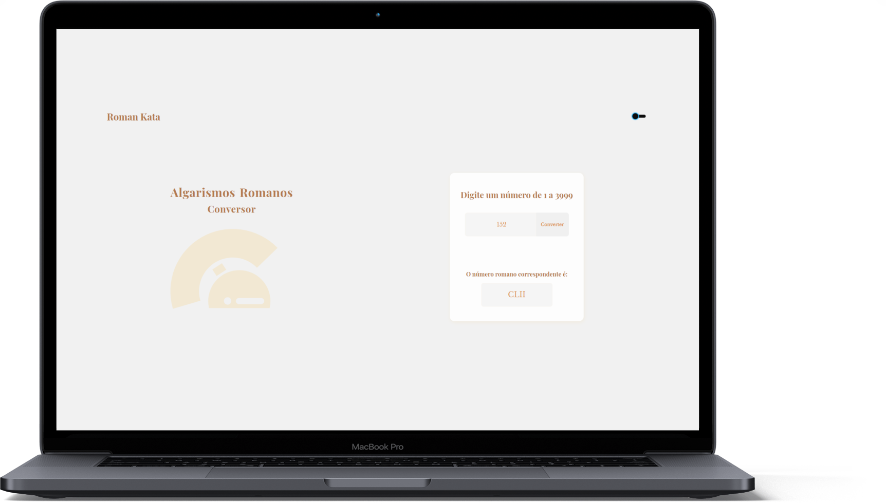
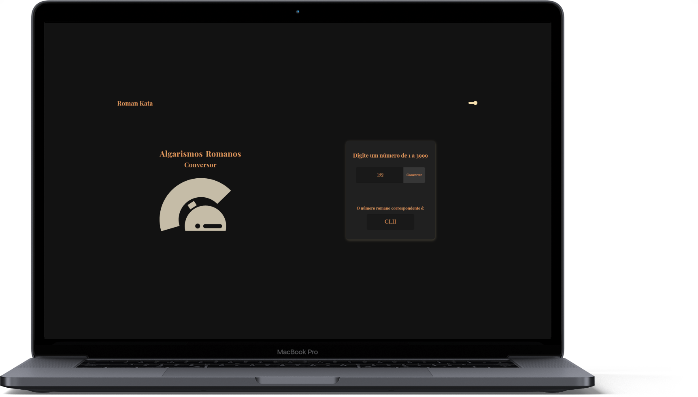

  <h1 align="center">
    
    </br>
    Algarismos Romanos - Conversor
  </h1>

  <p align="center">
    
    
  </p>

<h3 align="center">
  O projeto desenvolvido é um conversor de números para algarismos romanos.
</h3>

Estiveram envolvidos também no projeto:

  - [Arthur Pimentel Cordeiro](https://github.com/ARTHURPC03);
  - [Lara Beatriz](https://github.com/larabeatrizms);
  - [Wemerson Jesus](https://github.com/wejesuss).

<p align="center">
  

  

  
</p>

<p align="center">
  <a href="#funcionalidades">Funcionalidades</a>&nbsp;&nbsp;&nbsp;|&nbsp;&nbsp;&nbsp;
  <a href="#heavy_check_mark-configurações-necessárias">Configurações necessárias</a>&nbsp;&nbsp;&nbsp;|&nbsp;&nbsp;&nbsp;
  <a href="#arrow_down_small-clonando-o-repositório">Clonando o repositório</a>&nbsp;&nbsp;&nbsp;|&nbsp;&nbsp;&nbsp;
  <a href="#beginner-iniciando-a-aplicação">Iniciando a aplicação</a>&nbsp;&nbsp;&nbsp;|&nbsp;&nbsp;&nbsp;
  <a href="#wrench-tecnologias--ferramentas--recursos">Tecnologias | Ferramentas | Recursos</a>&nbsp;&nbsp;&nbsp;|&nbsp;&nbsp;&nbsp;
  <a href="#memo-license">Licença</a>
</p>

### Funcionalidades

- Conversão de números de 01 a 3999 para algarismos romanos;
- Mensagem de erro informando quando um número digitado está fora do intervalo configurado;
- Light e dark modes.

### :heavy_check_mark: Configurações necessárias

Seguem as configurações necessárias para visualizar a aplicação em sua máquina.

-  [Git](https://git-scm.com);
-  [Node](https://nodejs.org/);
-  [Yarn](https://yarnpkg.com/).

### :arrow_down_small: Clonando o repositório
1. Pelo terminal, acesse o diretório em que deseja ter o repositório clonado e execute o comando a seguir.
```bash
# clonando o repositório
git clone https://github.com/belapferreira/typescript-roman-kata
```

### :beginner: Iniciando a aplicação
1. Pelo terminal, acesse o diretório do repositório clonado e execute os comandos abaixo.
```bash
# instalando as dependências
yarn install

# iniciando a aplicação
yarn start
```
### :wrench: Tecnologias | Ferramentas | Recursos

Esse projeto foi desenvolvido utilizando os seguintes recursos:

-  [Editor Config](https://editorconfig.org/);
-  [Eslint](https://eslint.org/);
-  [Prettier](https://prettier.io/)
-  [React](https://pt-br.reactjs.org/);
-  [React DOM](https://pt-br.reactjs.org/docs/react-dom.html);
-  [React Router Dom](https://reactrouter.com/web/guides/quick-start);
-  [React Scripts](https://github.com/facebook/create-react-app/tree/master/packages/react-scripts);
-  [Styled Components](https://styled-components.com/);
-  [TypeScript](https://www.typescriptlang.org/);
-  [Uuidv4](https://github.com/thenativeweb/uuidv4);
-  [Yup](https://github.com/jquense/yup).


### :memo: License
Esse projeto está sob MIT license. Veja [LICENSE](https://github.com/belapferreira/typescript-roman-kata/blob/master/LICENSE) para mais informações.

---

Feito por Bela Ferreira :blue_heart: Contato: https://www.linkedin.com/in/belapferreira :blush:
